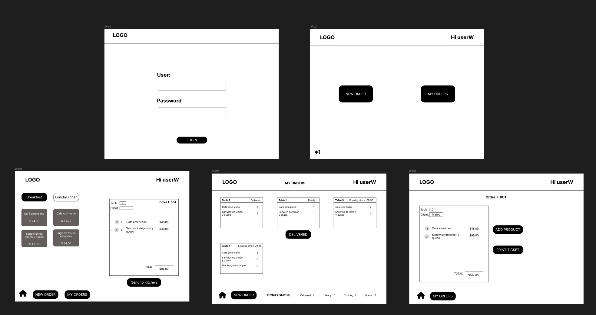
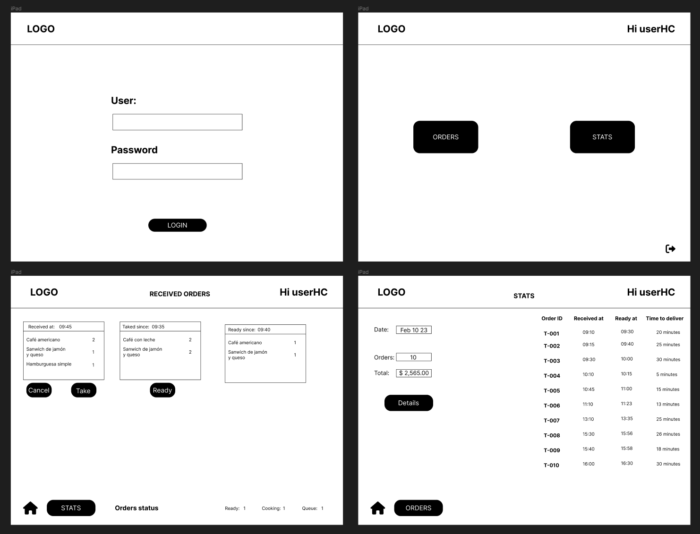
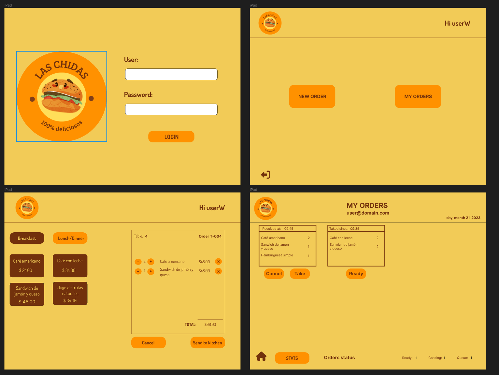
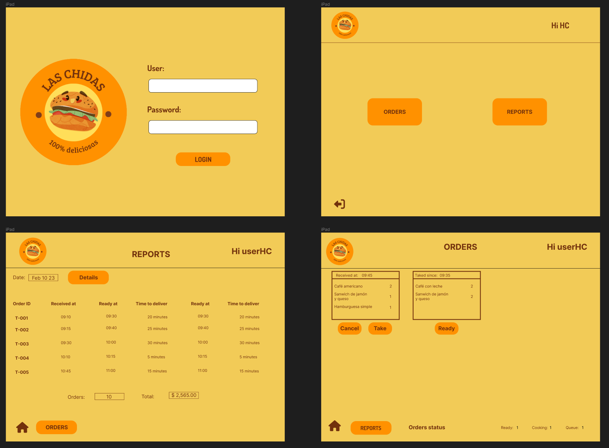
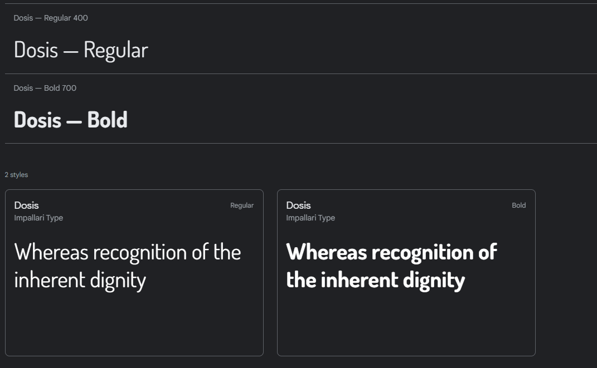

# [Las chidas](https://las-chidas.web.app/)

Aplicación web desarrollada y pensada para un restaurante de hamburguesas.

> Nuestra propuesta de servicio 24hrs ha tenido muy buena acogida y, para
> seguir creciendo, necesitamos un sistema que nos ayude a tomar los pedidos de
> nuestros clientes.
>
> Tenemos 2 menús: uno muy sencillo para el desayuno:
>
> | Ítem                      |Precio $|
> |---------------------------|------|
> | Café americano            |    24 |
> | Café con leche            |    34 |
> | Sandwich de jamón y queso |    48 |
> | Jugo de frutas natural              |    34 |
>
> Y otro menú para el resto del día:
>
> | Ítem                      |Precio|
> |---------------------------|------|
> |**Hamburguesas**           |   **$**   |
> |Hamburguesa simple         |    48|
> |Hamburguesa doble          |    72|
> |**Acompañamientos**        |   **$**   |
> |Papas fritas               |     24|
> |Aros de cebolla            |     24|
> |**Para tomar**             |   **$**   |
> |Agua 500ml                 |     24|
> |Agua 750ml                 |     34|
> |Bebida/gaseosa 500ml       |     34|
> |Bebida/gaseosa 750ml       |     48|

## 👫 Historias de usuari@

#### [Historia de usuario 1] Mesero/a debe poder tomar pedido de cliente

Yo como meserx quiero tomar el pedido de un cliente para no depender de mi mala
memoria, para saber cuánto cobrar, y enviarlo a la cocina para evitar errores y
que se puedan ir preparando en orden.

##### Criterios de aceptación

Lo que debe ocurrir para que se satisfagan las necesidades del usuario

* Anotar nombre de cliente.
* Agregar productos al pedido.
* Eliminar productos.
* Ver resumen y el total de la compra.
* Enviar pedido a cocina (guardar en alguna base de datos).
* Se ve y funciona bien en una _tablet_

##### Definición de terminado

Lo acordado que debe ocurrir para decir que la historia está terminada.

* Debes haber recibido _code review_ de al menos una compañera.
* Haces _test_ unitarios y, además, has testeado tu producto manualmente.
* Hiciste _tests_ de usabilidad e incorporaste el _feedback_ del usuario.
* Desplegaste tu aplicación y has etiquetado tu versión (git tag).

***

#### [Historia de usuario 2] Jefe de cocina debe ver los pedidos

Yo como jefx de cocina quiero ver los pedidos de los clientes en orden y
marcar cuáles están listos para saber qué se debe cocinar y avisar a lxs meserxs
que un pedido está listo para servirlo a un cliente.

##### Criterios de aceptación

* Ver los pedidos ordenados según se van haciendo.
* Marcar los pedidos que se han preparado y están listos para servirse.
* Ver el tiempo que tomó prepara el pedido desde que llegó hasta que se
  marcó como completado.

##### Definición de terminado

* Debes haber recibido _code review_ de al menos una compañera.
* Haces _test_ unitarios y, además, has testeado tu producto manualmente.
* Hiciste _tests_ de usabilidad e incorporaste el _feedback_ del usuario.
* Desplegaste tu aplicación y has etiquetado tu versión (git tag).

***

#### [Historia de usuario 3] Meserx debe ver pedidos listos para servir

Yo como meserx quiero ver los pedidos que están preparados para entregarlos
rápidamente a los clientes que las hicieron.

##### Criterios de aceptación

* Ver listado de pedido listos para servir.
* Marcar pedidos que han sido entregados.

##### Definición de terminado

* Debes haber recibido _code review_ de al menos una compañera.
* Haces _test_ unitarios y, además, has testeado tu producto manualmente.
* Hiciste _tests_ de usabilidad e incorporaste el _feedback_ del usuario.
* Desplegaste tu aplicación y has etiquetado tu versión (git tag).
* Los datos se deben mantener íntegros, incluso después de que un pedido ha
  terminado. Todo esto para poder tener estadísticas en el futuro.

***

## ✨ Diseño

### Prototipos de baja fidelidad 

### Prototipos de media fidelidad 

### Prototipos de alta fidelidad 

### Sistema de diseño

#### 🍔 Logotipo:

#### 🎨 Paleta de colores: 

main-color: #FF9100

complementary-color: #F2CB57

emphasis-color: #72310C

#### 📝 Fuente:

[Dosis](https://fonts.google.com/share?selection.family=Dosis:wght@400;700)

## 👩🏻‍💻 Desarrollo

### Front-end

### Backend

## Despliegue

👉🏻 [Las chidas](https://las-chidas.web.app/)

